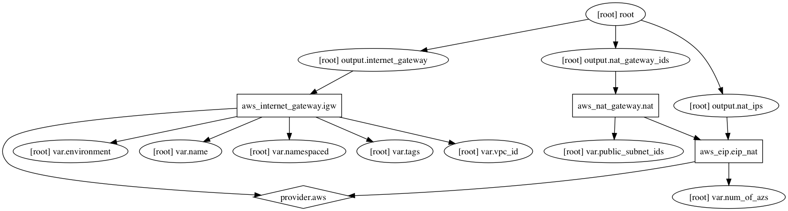

AWS Network Gateways Terraform Module
=====================

Usage:
------

    module "gateways" {
      source      = "../tf_gateways"

      add variables
    }

## Inputs

| Name | Description | Default | Required |
|------|-------------|:-----:|:-----:|
| environment | Environment (ex: dev, qa, stage, prod) | - | yes |
| name | Name | - | yes |
| namespaced | Namespace all resources (prefixed with the environment)? | `true` | no |
| num_of_azs | Number of multipe AZ to be utilized | `2` | no |
| public_subnet_ids |  | - | yes |
| tags | A map of tags to add to all resources | `<map>` | no |
| vpc_id | AWS VPC ID | - | yes |

## Outputs

| Name | Description |
|------|-------------|
| internet_gateway | Internet gateway |
| nat_gateway_ids | NAT gateway |
| nat_ips | The list of EIPs associated with the subnets. |

### Resource Graph

